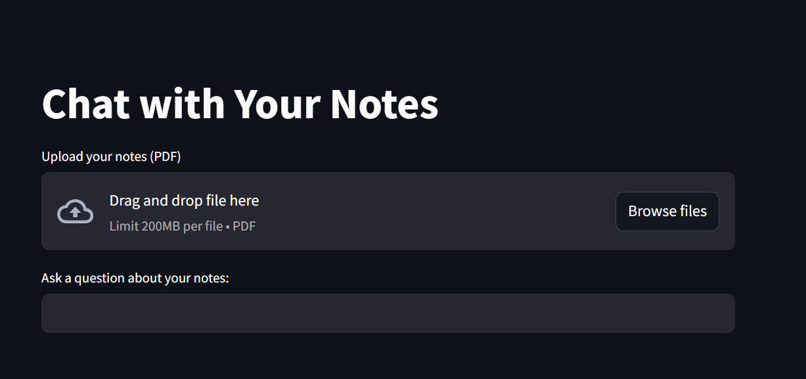

# 🧠 Chat with Your Notes

A simple and interactive app built with Streamlit that lets you upload your own PDF notes and ask questions about them using a local LLM (via Ollama). The app finds the most relevant sections of your notes and then generates a response using your chosen model (like llama3 or mistral).

---

## Features

- Upload any PDF document
- Automatic text chunking and semantic search
- Uses SentenceTransformers + FAISS for fast retrieval
- Local LLM response powered by Ollama
- Interactive UI using Streamlit
- Downloadable chat history (optional feature)

---

## Preview

 

---

## Tech Stack

- Python 3.x
- Streamlit
- PyPDF2
- sentence-transformers
- FAISS
- Ollama (local LLM runner)

---

## Installation

1. Clone this repo:
   ```bash
   git clone https://github.com/your-username/chat-with-your-notes.git
   cd chat-with-your-notes
# 2. Create a Virtual Environment 

```python -m venv venv```
```venv\Scripts\activate   # For Windows```
## OR
```source venv/bin/activate   # For Mac/Linux```
# 3. Install Required Packages
```pip install -r requirements.txt```

# 4. .env file
```OLLAMA_HOST=http://localhost:11434```
   ```MODEL=llama3:8b```

 # 5. Making sure Ollama is running 
```ollama run llama3:8b```

# 6.  Running streamlit app
```streamlit run main.py```

---

## 📸 How It Works

1. 📄 You upload a PDF file (your notes, article, or document).
2. 🧩 The app reads the file and splits the text into small chunks.
3. 🧠 Each chunk is converted into a numerical embedding using a SentenceTransformer.
4. 🔍 When you ask a question, the app searches for the most relevant chunks using FAISS (a fast similarity search tool).
5. 🧾 It creates a prompt combining your question and the most relevant content from the PDF.
6. 🤖 The prompt is sent to a locally running AI model (like LLaMA3 via Ollama) through its API.
7. 💬 You get a smart, contextual answer based only on your uploaded notes.

All processing happens on your machine — no cloud required!

---

